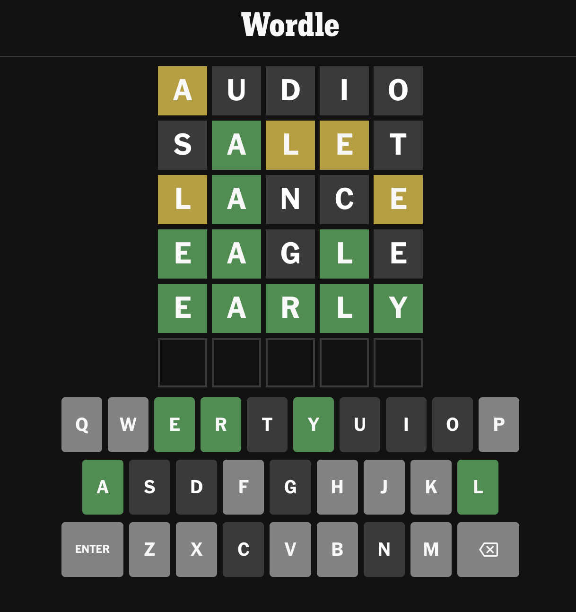
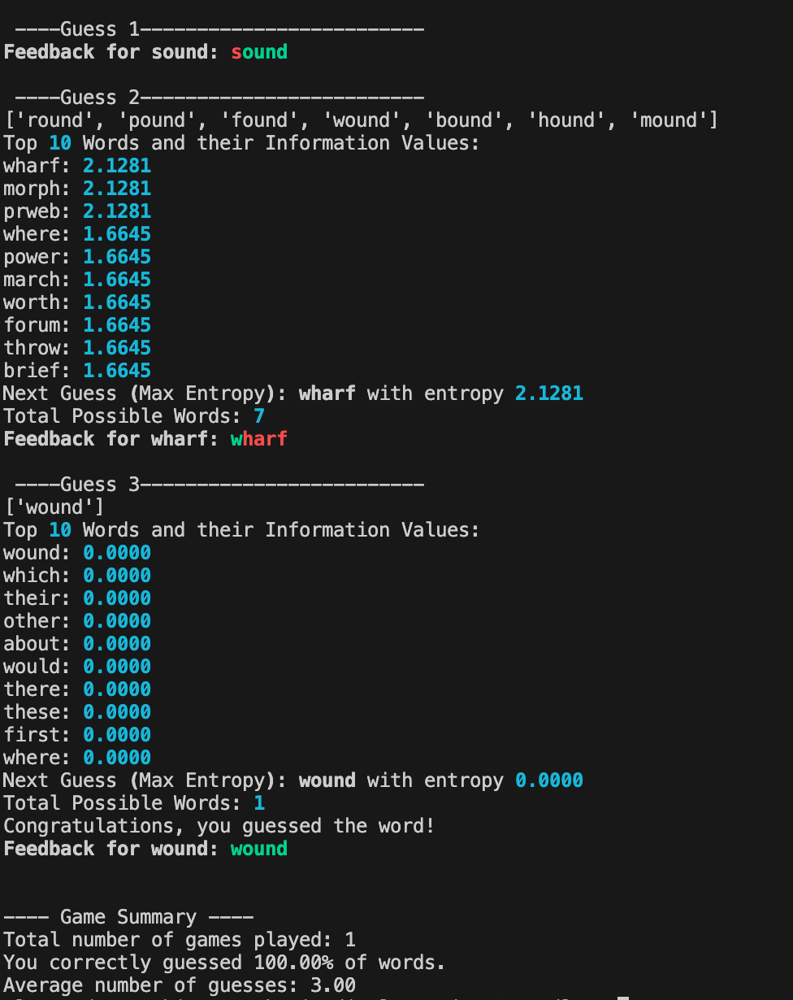

<a name="readme-top"></a>

<!-- PROJECT SHIELDS -->

<!--
*** I'm using markdown "reference style" links for readability.
*** Reference links are enclosed in brackets [ ] instead of parentheses ( ).
*** See the bottom of this document for the declaration of the reference variables
*** for contributors-url, forks-url, etc. This is an optional, concise syntax you may use.
*** https://www.markdownguide.org/basic-syntax/#reference-style-links
-->

[![Contributors][contributors-shield]][contributors-url]
[![Forks][forks-shield]][forks-url]
[![Stargazers][stars-shield]][stars-url]
[![Issues][issues-shield]][issues-url]
[![MIT License][license-shield]][license-url]
[![LinkedIn][linkedin-shield]][linkedin-url]

<!-- PROJECT LOGO -->

<br />
<div align="center">
  <a href="https://github.com/alessandro-vecchi/Wordle">
    
  </a>

<h3 align="center">Wordle Solver</h3>

</div>

<!-- TABLE OF CONTENTS -->

<details>
  <summary>Table of Contents</summary>
  <ol>
    <li>
      <a href="#about-the-project">About The Project</a>
      <ul>
        <li><a href="#built-with">Built With</a></li>
      </ul>
    </li>
    <li>
      <a href="#getting-started">Getting Started</a>
      <ul>
        <li><a href="#prerequisites">Prerequisites</a></li>
        <li><a href="#installation">Installation</a></li>
      </ul>
    </li>
    <li><a href="#usage">Usage</a></li>
    <li><a href="#examples">Examples</a></li>
    <li><a href="#roadmap">Roadmap</a></li>
    <li><a href="#license">License</a></li>
    <li><a href="#contact">Contact</a></li>
  </ol>
</details>

<!-- ABOUT THE PROJECT -->

## About The Project

The project aims at minimizing the number of guesses to solve a wordle game.

<div align="center">
  
</div>

<p align="right">(<a href="#readme-top">back to top</a>)</p>

### Built With

* [![Python]][Python-url]

<p align="right">(<a href="#readme-top">back to top</a>)</p>

<!-- USAGE EXAMPLES -->

## Usage

Once cloned, you can run the project with the following bash command:

```shell
python3 game.py --r int --print --profile --save filename.png
```

- The program argument `--r` is mandatory and refers to the number of runs of the wordle game. You can type any integer.
- The argument `--print` is optional. If added, print useful informations on the run, like the feedbacks from Wordle for each game, the top 10 words by entropy chosen by the guesser and the total possible pool of words to choose from.
- The argument `--profile` is optional. If added, opens a page browser where all the profile information of the functions can be seen.
- The argument `--save` is optional. If added, save the current distribution of guesses in a file named "filename.png" in the plot folder.

<p align="right">(<a href="#readme-top">back to top</a>)</p>

## Examples

The following is an instance of what's printed if the `--print` command is given:

<div align="center">
  
  
</div>

Here, we got lucky, meaning that our guess reduced the possible target words to 7. However, they all end in **ound**, therefore a random guesser could exhaust the guesses before guessing the word, even though there are only 7 words in the pool. This guesser instead, tries the word that gives the greater amount of information, reducing the size of the bucket as much as possible.

<p align="right">(<a href="#readme-top">back to top</a>)</p>

<!-- ROADMAP -->

## Roadmap

- [X] Add Badges
- [X] Add back to top links
- [X] Add License
- [X] Add Contact
- [X] Add Usage
- [X] Add Getting Started
- [ ] Add Changelog

<!-- LICENSE -->

## License

Distributed under the MIT License. See `LICENSE.txt` for more information.

<p align="right">(<a href="#readme-top">back to top</a>)</p>

<!-- CONTACT -->

## Contact

Alessandro Vecchi - alessandro.vecchi66@gmail.com

Project Link: [https://github.com/Alessandro-vecchi/Wordle](https://github.com/Alessandro-vecchi/Wordle)

<p align="right">(<a href="#readme-top">back to top</a>)</p>

<!-- MARKDOWN LINKS & IMAGES -->

<!-- https://www.markdownguide.org/basic-syntax/#reference-style-links 
[contributors-shield]: https://img.shields.io/github/contributors/github_username/repo_name.svg?style=for-the-badge
[contributors-url]: https://github.com/github_username/repo_name/graphs/contributors
-->

[contributors-shield]: https://img.shields.io/github/contributors/Alessandro-vecchi/Wordle.svg?style=for-the-badge
[contributors-url]: https://github.com/Alessandro-vecchi/Wordle/graphs/contributors
[forks-shield]: https://img.shields.io/github/forks/Alessandro-vecchi/Wordle.svg?style=for-the-badge
[forks-url]: https://github.com/Alessandro-vecchi/Wordle/network/members
[stars-shield]: https://img.shields.io/github/stars/Alessandro-vecchi/Wordle.svg?style=for-the-badge&logo=github&color=%23FFDD00
[stars-url]: https://github.com/Alessandro-vecchi/Wordle/stargazers
[issues-shield]: https://img.shields.io/github/issues/Alessandro-vecchi/Wordle.svg?style=for-the-badge
[issues-url]: https://github.com/Alessandro-vecchi/Wordle/issues
[license-shield]: https://img.shields.io/github/license/Alessandro-vecchi/Wordle?style=for-the-badge
[license-url]: https://github.com/Alessandro-vecchi/Wordle/blob/master/LICENSE.txt
[linkedin-shield]: https://img.shields.io/badge/-LinkedIn-black.svg?style=for-the-badge&logo=linkedin&colorB=555
[linkedin-url]: https://linkedin.com/in/alessandro-v-6711
[product-screenshot]: images/screenshot.png
[Python]: https://img.shields.io/badge/python-3670A0?style=for-the-badge&logo=python&logoColor=ffdd54
[Python-url]: https://python.org/
